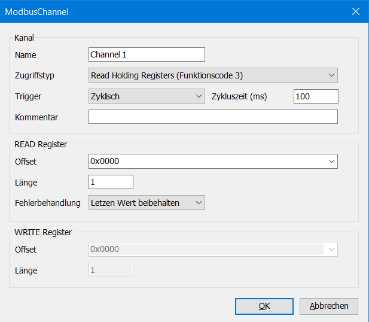

# Modbus Kommunikation zwischen zwei Maschinen
Deveci, Fentler 5CHIT  
## Vorraussetzungen

- Codesys V3.5 SP13 Patch1 (wurde verwendet)
- 2 Rechner
- 2 Applikationen, nicht die selbe (Müssen __64 Bit__ sein, sonst funktionierts nicht)
- aktive Internetverbindung

## Firewall Konfiguration
Wenn die Firewall blockiert, dann muss man den Port öffnen. In dem Fall muss man unter Windows in __Firewall & Netzwerkschutz/Erweiterte Einstellungen/Eingehende Regeln__ -> __Neue Regel/Port__  
Die Modbus Kommunikation verwendet standardmäßig den Port 502. Daher wird der auch bei der Eingangsregel in der Firewall erlaubt.

## Master - Konfiguration

### Geräte hinzufügen

Da man in der Aufgabe mit Ethernet arbeitet, muss als erstes ein Ethernet Knoten erstellt werden. Darunter werden dann der Master und der Slave erstellt und kofiguriert. Damit ein Ethernet-Knoten erstellt wird, muss mann folgedermaßen navigieren:
__Rechtsklick auf Device -> Gerät anhängen__
Daraufhin muss unter __Ethernet Adapter__ __Ethernet__ ausgewählt werden, damit der Knoten erstellt wird.

Anschließend muss der ModBus TCP Master an das zuvor erstellte Ethernet-Element angehängt werden. Dafür __Rechtsklick auf Ethernet -> Gerät anhängen... -> Modbus -> Modbus TCP Master -> Modbus TCP Master -> Gerät anhängen__
    
### Ethernet konfigurieren
Nun muss der Ethernet-Knoten konfiguriert werden. **Doppelklick auf Ethernet -> Auf den Reiter Allgemein switchen -> Auf den Button "..." drücken** und das gewünschte Netzwerkinterface auswählen. Die IP-Adresse, Subnetzmaske und das Gateway wird automatisch eingegeben. Somit ist die Konfiguration für den Master abgeschlossen

### Slave mit Master verknüpfen

Nun muss der Slave mit dem Master verknüpft werden. Dazu muss unter dem Masterknoten der Modbus TCP Slave eingebunden werden. **Dazu Rechtsklick auf Modbus_TCP_Master -> Gerät anhängen... -> Modbus TCP Slave**

### Slave konfigurieren

**Linksklick auf Modbus_TCP_Slave -> Allgemein -> IP-Adresse und Port eingeben vom Slave auf der 2. Steuerung**

### Kanal hinzufügen
Damit die beide Steuerungen kommunizieren können muss ein Kanal hinzugefügt werden. Dafür am Slave auf **Modbus- Slave-Kanal -> Kanal hinzufügen...** und folgende Parameter eingeben, sodass man 2 beschreibbare Ein- und Ausgänge hat:

## Slave - Konfiguration
### Slave anhängen
Als erstes einen „Ethernet Knoten“ im Gerätebaum einfügen __⇒ Device (rechtsklick) ⇒ Gerät anhängen…__  

An diesen Ethernet Knoten wird dann ein Modbus-Slave angehängt __⇒ Ethernet Kn. (rechtsklick) ⇒ Gerät anhängen… ⇒ Modbus ⇒ Modbus TCP Slave Device ⇒ Gerät anhängen ⇒ Schließen.__  

Danach sollte es so aussehen:  

### Ethernet - Verbindung
Jetzt muss auch hier die __TCP Verbindung konfiguriert__ werden. Dazu muss in den Einstellungen vom Ethernetknoten, die richtige Netzwerkschnittstelle ausgewählt werden. In diesem Fall haben wir uns entschieden über die WLAN-Schnittstelle zu arbeiten.  
Um die auszuwählen klickt man einfach auf die drei Punkte.  

__!!! ACHTUNG !!!__ Damit man hier was finden kann muss __Codesys Controll WIN V3 - x64 Systray__ laufen. (Wenn nicht läuft dann siehe _Starten_)

### Slave - Einstellungen
Beim Slave muss man eigentlich nicht viel einstellen. Das einzige was man machen muss ist, dass man die __Anzahl an Input und Holding Register__ angibt. Diese Anzahl sollte __mit der am Master übereinstimmen__. Weiters wählen wir auch den Haken an, dass diese Register überlagert werden sollen. _(Damit schaffen wir einen gemeinsamen Speicherbereich)_  

### E/A-Abbild Einstellungen
Hier muss noch die Buszykluszeit und bei den Variablen etwas eingestellt werden. Siehe Bild  
![slaveBuszyklus.PNG]

## Starten
Bevor man das Programm starten kann muss man sicherstellen, dass __Codesys Controll WIN V3 - x64 Systray__ läuft (Rechts unten bei diesen kleinen Symbolen, Rechtsklick auf das Programm ⇒ Start PLC).

Dann in Codesys __⇒ Einloggen ⇒ Starten__  
Jetzt sollte beim Slave und beim Master folgendes zu sehen sein:  

## Eingänge -> Ausgänge
Bei der Kommunikation zwischen Master und Slave wird ein Register als Speicherplatz für gemeinsam genütze Variablen verwendet. Die Eingänge am Slave sind die Ausgänge am Master (und umgekehrt).  
Die Eingänge sind im __Holding-Register__ und die Ausgänge im __Input-Register__

Diesen Eingängen/Ausgängen kann man auch __Variablen aus den Programmen zuweisen__. So kann man einen Schalter als Ausgangsvariable deklarieren.  
Der andere definiert eine Variable als Eingang. Diese Variable weist er einer Lampe zu -> Wenn jetzt der Schalter auf der einen Maschine aktiviert wird, leuchtet die Lampe auf der anderen Maschine.

## Überprüfung
Zur Überprüfung wurden auf dem Master und dem Slave jeweils eine Visualisierung, bestehend aus einer Lampe und einem Schalter, erstellt. Diesen Komponenten wurden die Variablem aus dem Register zugewiesen.  
Wenn nun bei dem einem Gerät der Schalter aktiviert wird, so leuchtet die Lampe am anderen Gerät - und umgekehrt.

## Quelle
https://www.codesys-blog.com/kommunikation/modbus-kommunikation-in-codesys/