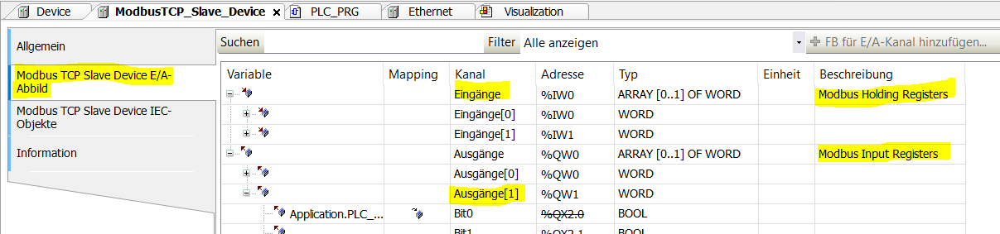

# Modbus Kommunikation zwischen zwei Maschinen

## Vorraussetzungen

- Codesys V3.5 SP13 Patch1 (wurde verwendet)
- 2 Rechner
- 2 Applikationen, nicht die selbe (Müssen __64 Bit__ sein, sonst funktionierts nicht)
- aktive Internetverbindung ;)

## Firewall Konfiguration
Wenn die Firewall blockiert, dann muss man den Port öffnen. In dem Fall muss man unter Windows in __Firewall & Netzwerkschutz/Erweiterte Einstellungen/Eingehende Regeln__ -> __Neue Regel/Port__  
Die Modbus Kommunikation verwendet standardmäßig den Port 502. Daher wird der auch bei der Eingangsregel in der Firewall erlaubt.

## Master - Konfiguration

### Geräte hinzufügen

Da man in der Aufgabe mit Ethernet arbeitet, muss als erstes ein Ethernet Knoten erstellt werden. Darunter werden dann der Master und der Slave erstellt und kofiguriert. Damit ein Ethernet-Knoten erstellt wird, muss mann folgedermaßen navigieren:
__Rechtsklick auf Device -> Gerät anhängen__
Daraufhin muss unter __Ethernet Adapter__ __Ethernet__ ausgewählt werden, damit der Knoten erstellt wird.

Anschließend muss der ModBus TCP Master an das zuvor erstellte Ethernet-Element angehängt werden. Dafür __Rechtsklick auf Ethernet -> Gerät anhängen... -> Modbus -> Modbus TCP Master -> Modbus TCP Master -> Gerät anhängen__
    
### Ethernet konfigurieren

## Slave - Konfiguration
### Slave anhängen
Als erstes einen „Ethernet Knoten“ im Gerätebaum einfügen __⇒ Device (rechtsklick) ⇒ Gerät anhängen…__  

An diesen Ethernet Knoten wird dann ein Modbus-Slave angehängt __⇒ Ethernet Kn. (rechtsklick) ⇒ Gerät anhängen… ⇒ Modbus ⇒ Modbus TCP Slave Device ⇒ Gerät anhängen ⇒ Schließen.__  

Danach sollte es so aussehen:  

### Ethernet - Verbindung
Jetzt muss auch hier die __TCP Verbindung konfiguriert__ werden. Dazu muss in den Einstellungen vom Ethernetknoten, die richtige Netzwerkschnittstelle ausgewählt werden. In diesem Fall haben wir uns entschieden über die WLAN-Schnittstelle zu arbeiten.  
Um die auszuwählen klickt man einfach auf die drei Punkte.  

__!!! ACHTUNG !!!__ Damit man hier was finden kann muss __Codesys Controll WIN V3 - x64 Systray__ laufen. (Wenn nicht läuft dann siehe _Starten_)

### Slave - Einstellungen
Beim Slave muss man eigentlich nicht viel einstellen. Das einzige was man machen muss ist, dass man die __Anzahl an Input und Holding Register__ angibt. Diese Anzahl sollte __mit der am Master übereinstimmen__. Weiters wählen wir auch den Haken an, dass diese Register überlagert werden sollen. _(Damit schaffen wir einen gemeinsamen Speicherbereich)_  

## Starten
Bevor man das Programm starten kann muss man sicherstellen, dass __Codesys Controll WIN V3 - x64 Systray__ läuft (Rechts unten bei diesen kleinen Symbolen, Rechtsklick auf das Programm ⇒ Start PLC).

Dann in Codesys __⇒ Einloggen ⇒ Starten__  
Jetzt sollte beim Slave und beim Master folgendes zu sehen sein:  

## Eingänge -> Ausgänge
Bei der Kommunikation zwischen Master und Slave sind die Ausgänge des Slaves die Eingänge des Masters. Dementsprechend muss man darauf achten, dass die Variablen auf die richtigen in der Registry gesetzt werden.

## Quelle
https://www.codesys-blog.com/kommunikation/modbus-kommunikation-in-codesys/